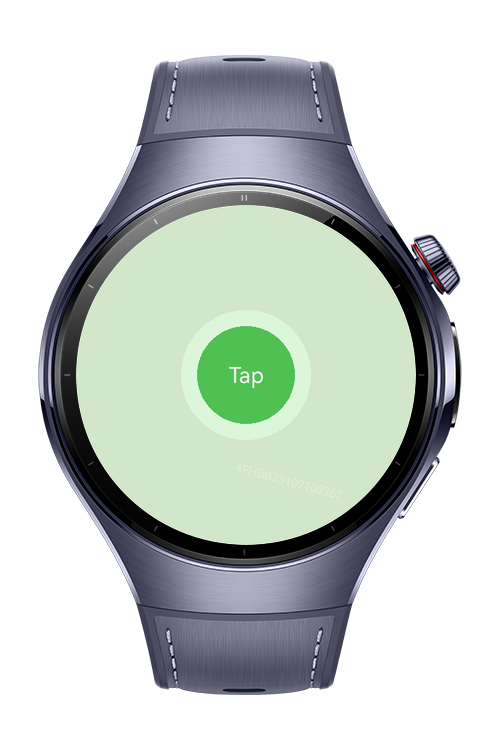
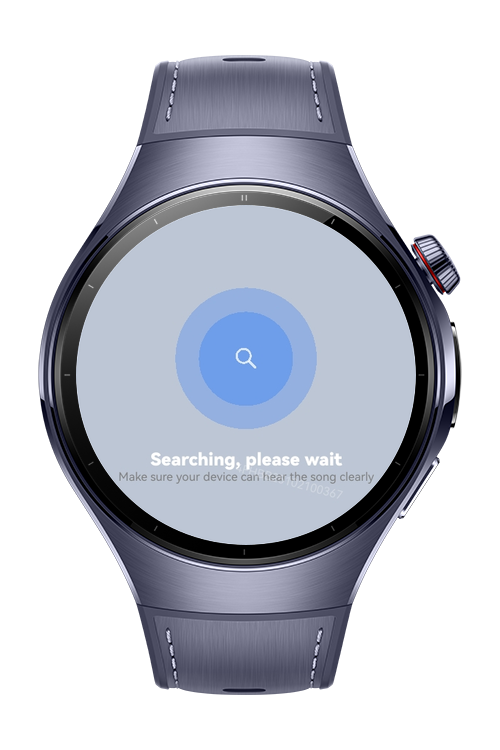
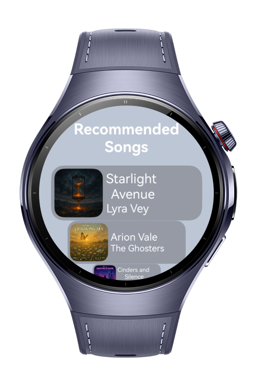

> **Note:** To access all shared projects, get information about environment setup, and view other guides, please visit [Explore-In-HMOS-Wearable Index](https://github.com/Explore-In-HMOS-Wearable/hmos-index).

# Song Player

This is a practical music recognition and recommendation app, built with ArkTS and ArkUI with intuitive animations, designed for HarmonyOS NEXT wearable devices. It leverages AudioKit and MediaKit and offers a seamless audio experience with circular screen support.

# Preview

<div>
    
    
    
</div>

# Use Cases

This demo application provides:
- Lottie animations for searching and scanning during analyzing the sound
- See the recommended song list and ability to pick a song of the list of recommended songs
- Play/pause listening functionality
- Simple and intuitive UI optimized for HarmonyOS smartwatches

# Tech Stack

- Languages: ArkTS
- Frameworks: Requires **DevEco Studio**
- Tools: Requires **DevEco Studio** 
- Libraries & Kits:

- `@kit.MediaKit`
- `@kit.AudioKit`
- `@kit.AbilityKit`
- `@kit.ArkUI`
- `@ohos.router`
- `@ohos/lottie`

# Project Directory

```
entry/src/main/ets/
ets/
│
├── common/
│   └── utils.ets
│
├── components/
│   ├── PlayPauseButton.ets
│   └── SongCardComponent.ets
│
├── constants/
│   ├── AppFontSize.ets
│   ├── AppFontWeight.ets
│   ├── ImageConstants.ets
│   └── SizeConstants.ets
│
├── entryability/
│   └── EntryAbility.ets
│
├── entrybackupability/
│   └── EntryBackupAbility.ets
│
├── models/
│   ├── DataModel.ets
│   └── SongModel.ets
│
├── pages/
│   ├── ListPage.ets
│   ├── ScanPage.ets
│   ├── SearchPage.ets
│   └── SongPage.ets
│
├── services/
│   └── AudioService.ets
│
├── utils/
│   ├── AVSessionController.ets
│   ├── BackgroundUtil.ets
│   ├── MediaController.ets
│   ├── MediaTools.ets
│   ├── RouterUtils.ets
│   └── SongData.ets
│
└── viewmodel/
    └── WearableViewModel.ets

resources/

```

# Constraints and Restrictions

## Supported Device
- Huawei Watch 5

# License

Song Player is distributed under the terms of the MIT License
See the [LICENSE](./LICENSE) for more information.

